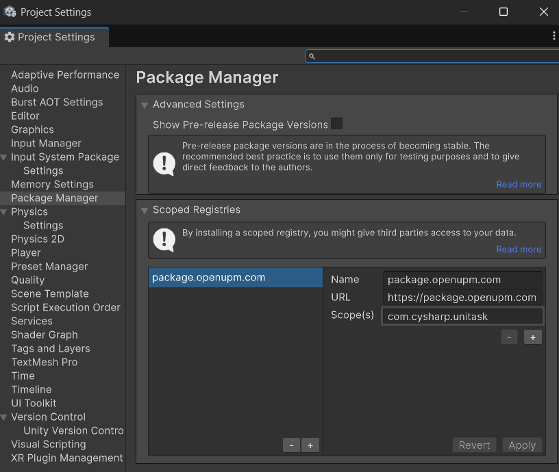
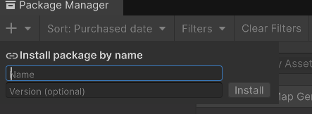
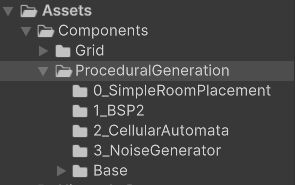
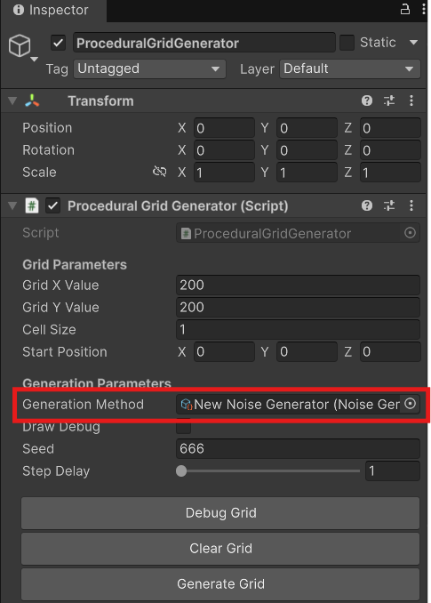
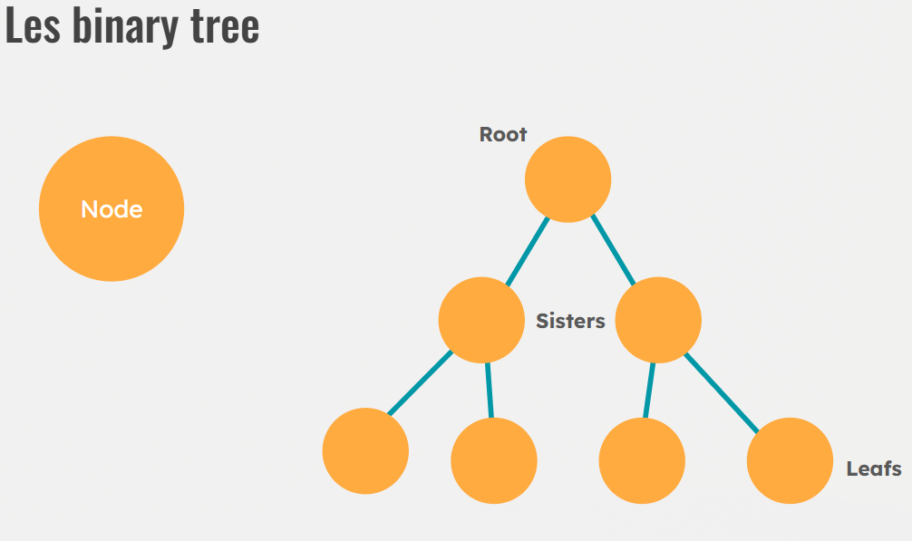
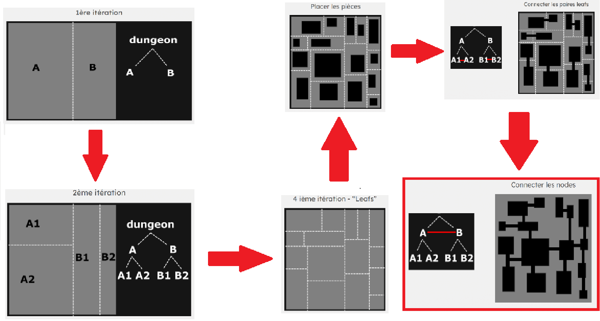
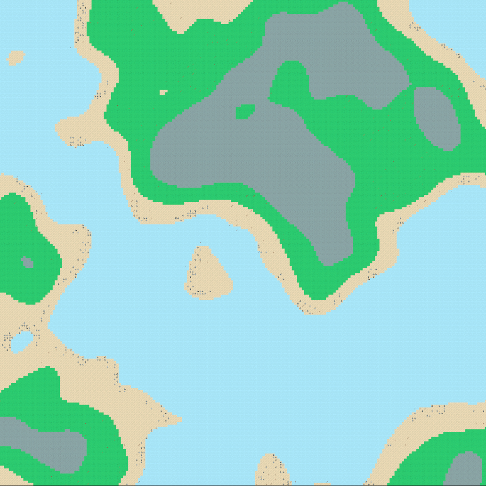
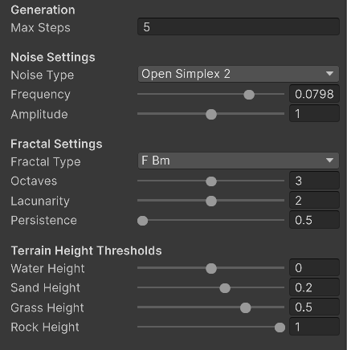

---

**Elias ROUSSEAU**  
> Gaming Campus GTech3 Groupe GameBoy - 2025-2026  
> Semaine Théorique sur Unity - `Algorythme pour Jeu Procédurale`  

 

---

### Sommaires

- [Mise en place et Initialisation](#mise-en-place-et-initialisation)
- [SimpleRoomPlacement](#simpleroomplacement)
- [BSP](#bsp)
- [CellularAutomata](#cellularautomata)
- [NoiseGenerator](#noisegenerator)

 

---

### Mise en place et Initialisation

Important sinon le projet ne fonctionnera pas !  
Utilisation de **`UniTask`** :  
-> Guide d'installation d' UniTask : [**Lien UniTask OpenUPM**](https://openupm.com/packages/com.cysharp.unitask/#modal-manualinstallation)  

  

**1ère Étape**  
Sur Unity :  
- Onglet → Edit  
- Project Setting  
- Package Manager  

| Name  : `package.openupm.com`  
| URL   : `https://package.openupm.com`  
| Scope : `com.cysharp.unitask`  

Cette onglet apparaitra :
  

  

**2ème Étape**  
Une fois appliqué, fermer la fenêtre et faire :  
- Onglet → Window  
- Package Manager  
- +  
- Name : `com.cysharp.unitask` | version : `2.5.10`  

Ceci dans cette interface :
  

  

**3ème Étape** *(Non obligatoire, seulement pour recommencer avec une base basique)*  
Télécharger le package découverte de UTKOWSKI Yona (intervenant) :  
[**LienDriveCampus**](https://drive.google.com/drive/folders/1QxmWzBSGsTq-miRODwUX_zA8UEcFaUDW)  
Nom du package : `ArchitectureProceduralGeneration.unitypackage`  
Glisser le package dans la **Hierarchy** Unity, puis importer le tout.

  

**FIN INITIALISATION**

Maintenant le projet contient les éléments de génération procédural :  
- SimpleRoomPlacement  
- BSP  
- Cellular Automata  
- Noise

Les scripts de génération procédural sont ici:
  

  

### Informations Complémentaires

**SEED**:  
- Utilisation de `RandomService()` avec la Seed pour contrôler l'aléatoire. 
- L'utilisation d'une Seed permet d'avoir du un résultat pseudo-aléatoire (par exemple Minecraft).  
- Le changement de la Seed entrainera un résultat différent. L'utilisation d'une même Seed, on retrouvera le même résultat.  
- Toujours utilisé la même méthode de génération pour obtenir les mêmes générations.

 

---

## SimpleRoomPlacement

Allez sur la scène `GridGenerator`.  
Sur le GameObject `ProceduralGridGenerator`, vérifier que la variable `GenerationMethod` à le ScriptableObject `Simple Room Placement` d'attaché.
Pour changer d'algorithme de génération, changer le ScriptableObject attaché avec l'un des 4 du projet ou le votre :
  

Si ce n'est pas le bon scriptableObject, le trouver dans:  
`Assets > Components > ProceduralGeneration > 0_SimpleRoomPlacement > SimpleRoomPlacement`  
Glisser/déposer dans l'inspector de `ProceduralGridGenerator` → `GenerationMethod`.  
Il est également possible de sélectionner directement le ScriptableObject sans glisser déposer en appuiant sur le cercle à coté la zone :
  

**Étapes du ScriptableObject `Simple Room Placement.cs`**:  
1. Créer une `Room` de taille aléatoire entre (`minSizeX/Y` et `maxSizeX/Y`).  
2. Place la `Room` aléatoirement dans la grille.  
3. Vérifier si la `Room` chevauche une `Room` déjà en place.  
4. Répéter les étapes 1 à 3 jusqu'à atteindre `MaxRooms` ou `MaxSteps`.  
5. Relier les rooms entre elles via le centre, en créant des couloirs horizontalement et verticalement en suivant l'ordre d'instanciation.

 

---

## BSP

Script utilisé `ProceduralGridGenerator` avec ScriptableObject `BSP2`.  
Libre à vous de tester les autres BSP.  

Rappel sur `Binary Tree` :  
 

**Étapes réalisé lors de la génération BSP:**  
 

 

---

## CellularAutomata

Scripts utilisé: `ProceduralGridGenerator` avec ScriptableObject `CellularAutomata`.  
### Paramètres du ScriptableObject CellularAutomata

- `MaxSteps` : Nombre maximum d’itérations du Cellular Automata.  
- `_noiseDensity` : Pourcentage de Cell Grass au départ.   
- `_grassThreshold` : Nombre minimum de voisin Grass pour que une Cell devien Grass (0 → 8). 
 

La case rouge devient une case jaunatre si elle a 5 voisins jaunatre ou plus.

**Étapes:**  
1. Remplir la grille procéduralement avec les Cell Grass et Water selon `_noiseDensity`.  
2. Création d'une grille selon `minGroundNeighbourCount`.  
3. Remplacement des Cell si condition remplie.  
4. Répéter le procèder jusqu' `MaxSteps`.

 

---

## NoiseGenerator

Scripts utilisé `ProceduralGridGenerator` avec ScriptableObject `NoiseGenerator`.
### Paramètres du ScriptableObject NoiseGenerator

**Noise Settings**  
- `noiseType` : type de bruit (ex : Perlin, Gradient, etc.)  
- `frequency` : fréquence du bruit (ex : 0.01 → 0.1)  
- `amplitude` : amplitude du bruit (ex : 0.5 → 1.5)  

**Fractal Settings**  
- `fractalType` : type de fractale (ex : FBm, Billow, etc.)  
- `octaves` : nombre de couches fractales (1 → 5)  
- `lacunarity` : écart entre les octaves (1 → 3)  
- `persistence` : influence de chaque octave (0.5 → 1)  

**Terrain Height Thresholds**  
- `waterHeight` : seuil de l'eau (-1 → 1)  
- `sandHeight` : seuil du sable (-1 → 1)  
- `grassHeight` : seuil de l'herbe (-1 → 1)  
- `rockHeight` : seuil des rochers (-1 → 1)

### Noise Settings  
- `noiseType` : type de bruit (ex : Perlin, Gradient, ...)  
- `frequency` : fréquence du bruit (0.01 → 0.1)  
- `amplitude` : amplitude du bruit (0.5 → 1.5)  

### Fractal Settings  
- `fractalType` : type de fractale (FBm, Billow, ...)  
- `octaves` : nombre de couches fractales (1 → 5)  
- `lacunarity` : écart entre les octaves (1 → 3)  
- `persistence` : influence de chaque octave (0.5 → 1)  

### Terrain Height Thresholds  
- `waterHeight` : seuil de l'eau (-1 → 1)  
- `sandHeight` : seuil du sable (-1 → 1)  
- `grassHeight` : seuil de l’herbe (-1 → 1)  
- `rockHeight` : seuil des rochers (-1 → 1)

---
### Éléments sur la map

### Tree Settings  
- `enableTrees` : active ou désactive la génération d’arbres  
- `vegetationFrequency` : fréquence du bruit pour les arbres (0.001 → 0.5)  
- `treeThreshold` : seuil du bruit pour autoriser un arbre (-1 → 1)  
- `treeDensity` : densité d’arbres (0 → 1)  
- `treeMinDistance` : distance minimale entre deux arbres (0 → 6)  
- `treeTemplateNames` : noms des templates d’arbres  
- `verboseTreeDebug` : active le debug des arbres  

### Branches Settings  
- `enableBranches` : active/désactive la génération de branches  
- `branchFrequency` : fréquence du bruit pour les branches (0.001 → 0.5)  
- `branchThreshold` : seuil du bruit pour les branches (-1 → 1)  
- `branchDensity` : densité de branches (0 → 1)  
- `branchMinDistance` : distance minimale entre branches (0 → 6)  
- `branchMaxWaterDistance` : distance max entre une branche et l’eau (0 → 6)  
- `branchTemplateNames` : noms des templates de branches  
- `verboseBranchDebug` : debug pour les branches  

### Gallais Settings  
- `enableGallais` : active/désactive les Gallais  
- `gallaiFrequency` : fréquence du bruit (0.001 → 0.5)  
- `gallaiThreshold` : seuil du bruit (-1 → 1)  
- `gallaiDensity` : densité (0 → 1)  
- `gallaiMinDistance` : distance minimale entre Gallais (0 → 6)  
- `gallaiMaxDistance` : distance maximale entre Gallais (0 → 6)  
- `gallaiMinDistanceFromWater` : distance minimale depuis l’eau (0 → 8)  
- `gallaiMaxDistanceFromWater` : distance maximale depuis l’eau (1 → 8)  
- `gallaiSpawnAnywhere` : autorise le spawn peu importe l’environnement  
- `gallaiTemplateNames` : templates utilisés  
- `verboseGallaiDebug` : debug Gallais  

### Autres paramètres  
- `seed` : seed utilisée pour générer le monde (1337 par défaut)

### Variables internes (debug / analyse)  
*U utiles pour comprendre le comportement du générateur et débuger*  
- `treesPlaced` : nombre d’arbres placés  
- `branchesPlaced` : nombre de branches placées  
- `gallaisPlaced` : nombre de Gallais placés  
- `grassCells` : nombre de cellules d’herbe détectées  
- `treeNoisePassed` : cellules validées par le bruit des arbres  
- `treeDensityPassed` : cellules validées par la densité  
- `treeOccupancyFailed` : placements invalidés par collision

Exemple avec la seed 666 avec grid 200/200 : 
  

**Génération de la grille avec le Noise:**  
1. Initialiser le type de bruit.  
2. Choisir la hauteur pour chaque type de cellule.  
3. Comparer aux seuils Water/Sand/Grass/Rock.  
4. Dessiner les cellules.  
5. Refaire pour toute la grille.  
6. Personaliser tout les paramètres pour le rendu souhaité.

 

---

Remerciements:  
- Merci à RUTKOWSKI Yona, intervenant de notre classe GTECH 3 pour son enseignement.
- Cysharp pour l'utilisatoin UniTask
- Auburn pour l'utilisation de FastNoiseLite
